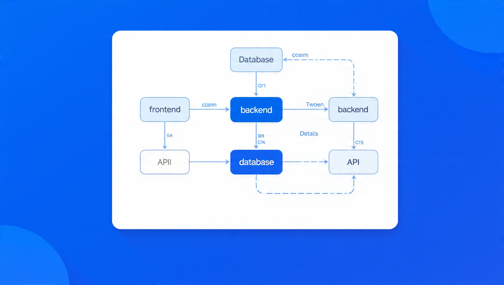

[](https://github.com/ibra8y3-web/RepoSeed-Full.git)
# RepoSeed 🌱
### أداة النشر الذكي لمستودعات GitHub - بدون إعلانات

RepoSeed تخلي أي مستودع (بتاعك أو بتاع غيرك) يظهر لآلاف المطورين بطرق GitHub يحبها: Pull Requests للـ Awesome Lists، Badges، GitHub Actions، ومقالات تلقائية.



## 🎯 لماذا RepoSeed؟

| المشكلة | الحل |
|---------|------|
| مستودعك مدفون | PR تلقائي لأكبر Awesome Lists |
| لا أحد يعرف مشروعك | Badge ينتشر مع كل مستخدم |
| الترويج يعتبر سبام | كل الطرق تستخدم ميزات GitHub الرسمية |

## 🚀 طرق الاستخدام (اختر ما يناسبك)

### 1. سطر أوامر سريع (لأي مستودع)
```bash
npx reposeed seed https://github.com/owner/repo
```

### 2. وضع Auto (لصاحب المستودع)
```bash
cd my-repo
npx reposeed auto
```

### 3. GitHub Action (يعمل تلقائياً عند كل push)
انسخ ملف `action-template/reposeed.yml` إلى `.github/workflows/`

## 📦 التثبيت

**الأنظمة المدعومة:** Windows, macOS, Linux, Docker

```bash
git clone https://github.com/you/reposeed
cd reposeed
npm install
npm run build
```

يتطلب Node.js 18+

## 🗺️ خريطة العمل

```
[مستودع] → [تحليل] → [اختيار استراتيجية] → [توليد PR/Badge/Action] → [نشر]
```

## 📹 فيديو 30 ثانية

> الفيديو موجود كسكريبت في `assets/video-script.md`

**نص الفيديو:**
```
0-5s: "عندك مشروع رائع ولا أحد يشوفه؟"
5-12s: "npx reposeed auto - سطر واحد"
12-20s: "يظهر تلقائياً في Awesome Lists"
20-27s: "Badge ينتشر مع كل مستخدم"
27-30s: "RepoSeed - النشر الذكي"
```

## 🤝 المساهمة
اقرأ `CONTRIBUTING.md`
